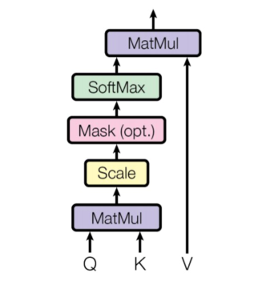
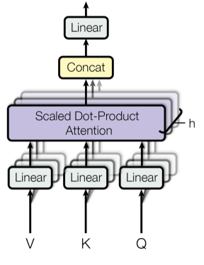

# Transformers
This repository contains notebooks demonstrating how to create the various components of a transformer language model from scratch. The notebooks will loosely follow Andrej Karpathy's Pytorch implementation in his video [2].

## Implementation Details
The main focus is on understanding how transformers work not on the raw computational performance, so we will use the "tiny shakespeare" dataset for training. Jax and Flax are used for creating all the models.  

## Models
The models start from the simplest to the most complicated. As you progress through the notebooks, more components of the transformer will be developed.
### Bigram
The bigram model is the simplest autoregressive language model. It isn't a transformer, but it contains important parts of the transformer, such as the token embedding. This makes it ideal for demonstrating how to to develop the minimum infrastructure needed to develop an autoregressive text prediction model. Most of this infrastructure will then be used in the later notebooks for the transformer models.

### Scaled Self-Attention


This is a transformer decoder model containing a scaled self-attention block. It is the simplest transformer model. This notebook demonstrates how the attention mechanism works by using the most fundamental components, the query, key, and value (Q, K, V). They interact with each other following the process shown in the image above. 

### Multi-Headed Self-Attention


Multi-headed self-attention is a block containing multiple scaled self-attention models in parallel, which are then concatenated and processed through a dense layer, as shown in the image above. Its main advantage over the single-headed self-attention is that it can capture information from different representation subspaces. This enables it to capture more diverse and complex subspaces in the input space.


## Installation Requirements:
If you have a GPU you can install Jax by running the following first:
```
pip install --upgrade "jax[cuda]" -f https://storage.googleapis.com/jax-releases/jax_cuda_releases.html
```
All the other requirements are provided below:
```
pip install --upgrade git+https://github.com/google/flax.git
pip install optax
pip install numpy
pip install jupyter

```


### References:
- [1] [GPT colab notebook](https://colab.research.google.com/drive/1JMLa53HDuA-i7ZBmqV7ZnA3c_fvtXnx-?usp=sharing)
- [2] [Video: Let's build GPT: from scratch, in code, spelled out.](https://www.youtube.com/watch?v=kCc8FmEb1nY&ab_channel=AndrejKarpathy)
- [3] [Attention Is All You Need](https://arxiv.org/abs/1706.03762)
